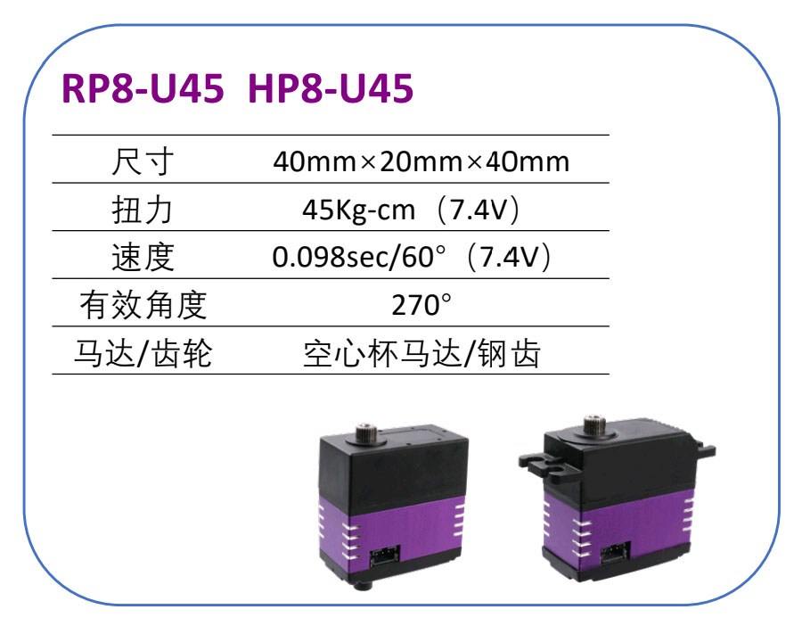

# 云台主题课程(STM32+OpenMV)

出品: [深圳市华馨京科技有限公司](https://fashionstar.asia/) | [FashionStar 官方淘宝店铺](https://shop553323205.taobao.com)　

关键词: *UART舵机*, *STM32F103*, *OpenMV*, *视觉跟踪*,  *PID控制*,  *激光打点*,  *运动学* 

## 目录

* [准备工作](#准备工作)

* [UART舵机SDK例程](#UART舵机SDK例程)
* [云台控制基础](#云台控制基础)
* [云台视觉跟踪](#云台视觉跟踪)
* [云台激光打点](#云台激光打点)

## 准备工作

* [物料清单](1.1.物料清单/物料清单.md)
* [开发环境配置](1.2.开发环境配置/开发环境配置.md)
* [工程结构](1.3.工程结构/工程结构.md)
* [接线说明](1.4.接线说明/接线说明.md)
* [舵机云台组装教程](1.5.舵机云台组装教程/舵机云台组装教程.md)

### UART舵机SDK例程

* [舵机通讯检测](2.1.舵机通讯检测/舵机通讯检测.md)
* [舵机角度控制](2.2.舵机角度控制/舵机角度控制.md)
* [舵机阻尼模式](2.3.舵机阻尼模式/舵机阻尼模式.md)
* [舵机轮式模式](2.4.舵机轮式模式/舵机轮式模式.md)
* [舵机用户自定义数据](2.5.舵机用户自定义数据/舵机用户自定义数据.md)

### 云台控制基础

* [机器人的坐标系与位姿](3.1.机器人的坐标系与位姿/机器人的坐标系与位姿.md)
* [设置云台的RPY角](3.2.设置云台的RPY角/设置云台的RPY角.md)

### 云台视觉跟踪

* [OpenMV学习资源汇总](4.1.OpenMV学习资源汇总/OpenMV学习资源汇总.md)
* [OpenMV色块识别](4.2.OpenMV色块识别/OpenMV色块识别.md)
* [STM32与OpenMV串口通信](4.3.STM32与OpenMV串口通信/STM32与OpenMV串口通信.md)
* [云台色块追踪-偏航角PID控制](4.4.云台色块追踪-偏航角PID控制/云台色块追踪-偏航角PID控制.md)
* [云台色块追踪-双轴PID控制](4.5.云台色块追踪-双轴PID控制/云台色块追踪-双轴PID控制.md)

### 云台激光打点

* [云台激光打点](5.1.云台激光打点/云台激光打点.md)